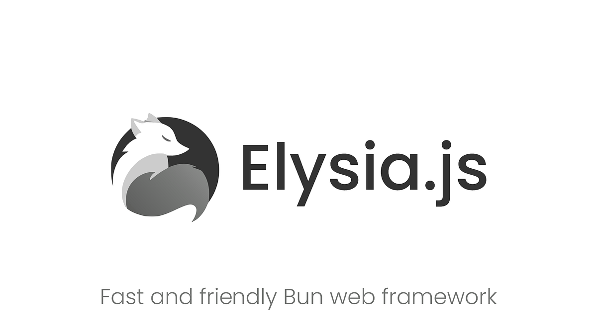

# Elysia.js Backend Template



Template backend lengkap dengan Elysia.js, Drizzle ORM, dan autentikasi JWT untuk pengembangan aplikasi web modern.

## ✨ Fitur

- 🚀 **Elysia.js** - Framework web TypeScript yang cepat dengan Bun runtime
- 🔐 **JWT Authentication** - Sistem login/register dengan token JWT
- 📚 **Swagger Documentation** - Dokumentasi API otomatis
- 🗄️ **Drizzle ORM** - ORM modern untuk PostgreSQL
- 🔒 **Password Hashing** - Hashing password dengan bcrypt (built-in Bun)
- 📝 **TypeScript** - Type safety penuh
- 🎯 **Type Validation** - Validasi request/response dengan TypeBox
- 🛡️ **Rate Limiting** - Proteksi API dari abuse dengan rate limiting
- 🧪 **Testing Suite** - Unit testing dengan Vitest, E2E testing siap pakai
- 🌐 **CORS Support** - Cross-Origin Resource Sharing untuk frontend integration

## 🚀 Quick Start

### 1. Clone dan Install Dependencies

```bash
git clone <repository-url>
cd elysia-template
bun install
```

### 2. Setup Database

Pastikan PostgreSQL sudah berjalan, lalu buat database baru:

```sql
CREATE DATABASE myapp;
```

### 3. Konfigurasi Environment

Copy `.env.template` ke `.env` dan isi dengan konfigurasi database Anda:

```bash
DB_HOST="localhost"
DB_PORT="5432"  # 5433 jika menggunakan Docker PostgreSQL
DB_USER="your_db_username"
DB_PASSWORD="your_db_password"
DB_NAME="myapp"
JWT_SECRET="your-super-secret-jwt-key-min-32-chars"
```

### 4. Setup Database Schema

Jalankan migrasi database:

```bash
bunx drizzle-kit generate
bunx drizzle-kit migrate
```

### 5. Jalankan Development Server

```bash
bun run dev
```

Server akan berjalan di `http://localhost:3000`

## 📖 API Documentation

Setelah server berjalan, akses dokumentasi Swagger di:

- **Root URL**: <http://localhost:3000/> (Welcome page)
- **Swagger UI**: <http://localhost:3000/docs>
- **API Base URL**: <http://localhost:3000/api>

## 🔧 Available Scripts

### Development

- `bun run dev` - Jalankan development server dengan hot reload

### Build & Production

- `bun run build` - Build aplikasi untuk production
- `bun run start` - Jalankan aplikasi production

### Database

- `bun run migrate:generate` - Generate migrasi database
- `bun run migrate:push` - Push schema ke database
- `bun run db:studio` - Buka Drizzle Studio untuk melihat database

### Testing

- `bun run test` - Jalankan unit tests
- `bun run test:ui` - Jalankan tests dengan UI Vitest
- `bun run test:e2e` - Jalankan end-to-end tests

## 📁 Struktur Proyek

```text
src/
├── auth/           # Fungsi autentikasi (hash, verify, dll)
├── constants.ts    # API status codes, messages, dan helper functions
├── db/            # Konfigurasi database dan schema
│   ├── index.ts   # Koneksi database dengan PostgreSQL
│   └── schema.ts  # Definisi tabel users dengan Drizzle ORM
├── index.ts       # Main server, routes, CORS, dan middleware
└── ...
```

## 🔐 API Endpoints

### Authentication

- `POST /api/register` - Registrasi user baru
- `POST /api/login` - Login dan dapatkan JWT token
- `GET /api/profile` - Get user profile (protected)
- `GET /api/users` - Get all users (protected)

### API Response Format

Semua API responses menggunakan format standar:

```json
{
  "status": "OK",
  "message": "user.created",
  "data": { ... }
}
```

**Status Codes:**

- `OK` - Berhasil
- `ERROR` - Error umum
- `UNAUTHORIZED` - Tidak terautentikasi
- `NOT_FOUND` - Data tidak ditemukan
- `BAD_REQUEST` - Request tidak valid

**Messages menggunakan dot notation** untuk i18n support.

### Database Schema

Tabel `users` dengan field lengkap untuk multi-tenant application:

```sql
users (
  user_id (PK), tenant_id, email, password, fullname,
  phone, private_key, active, active_datetime,
  non_active_datetime, create_user_id, update_user_id,
  create_datetime, update_datetime, version
)
```

### Constants Structure

```typescript
// src/constants.ts - API responses dengan i18n support
export const STATUS = {
  OK: 'OK',
  ERROR: 'ERROR',
  UNAUTHORIZED: 'UNAUTHORIZED',
  // ...
} as const;

export const MESSAGES = {
  'user.created': 'user.created',
  'login.success': 'login.success',
  // ...
} as const;

export const ERROR_MESSAGES = {
  INVALID_CREDENTIALS: 'error.invalid_credentials',
  // ...
} as const;

// Helper function untuk automatic prefix
export function getMessage(status: string, messageKey: string): string {
  // Otomatis tambah prefix "error." untuk error status
}
```

## 🛠️ Tech Stack

- **Runtime**: [Bun](https://bun.sh/)
- **Framework**: [Elysia.js](https://elysiajs.com/)
- **Database**: [PostgreSQL](https://postgresql.org/)
- **ORM**: [Drizzle ORM](https://orm.drizzle.team/)
- **Auth**: [@elysiajs/jwt](https://github.com/elysiajs/eden)
- **Docs**: [@elysiajs/swagger](https://github.com/elysiajs/swagger)
- **CORS**: [@elysiajs/cors](https://github.com/elysiajs/cors)
- **Rate Limiting**: [elysia-rate-limit](https://github.com/bogeychan/elysia-rate-limit)
- **Validation**: [TypeBox](https://github.com/sinclairzx81/typebox)
- **Testing**: [Vitest](https://vitest.dev/) + [Supertest](https://github.com/ladjs/supertest)

## 📝 Development Notes

- **Authentication**: Password di-hash menggunakan Bun's bcrypt (cost 10), JWT valid 7 hari
- **Database**: PostgreSQL dengan Drizzle ORM, schema menggunakan `user_id` sebagai PK untuk join support
- **API Design**: Standardized responses dengan status codes & dot notation messages untuk i18n
- **Documentation**: Swagger auto-generated dari route definitions
- **Type Safety**: Full TypeScript dengan TypeBox validation
- **Security**: CORS enabled, rate limiting, JWT authentication
- **Testing**: Complete suite dengan Vitest untuk unit & E2E testing
- **Multi-tenant**: Support untuk tenant_id di semua user records
- **Constants**: Centralized status codes, messages, dan helper functions

## 🚀 Production Deployment

1. Setup environment variables untuk production
2. Pastikan database PostgreSQL tersedia
3. Jalankan migrasi: `drizzle-kit migrate`
4. Build dan deploy aplikasi

---

## Happy coding! 🎉
